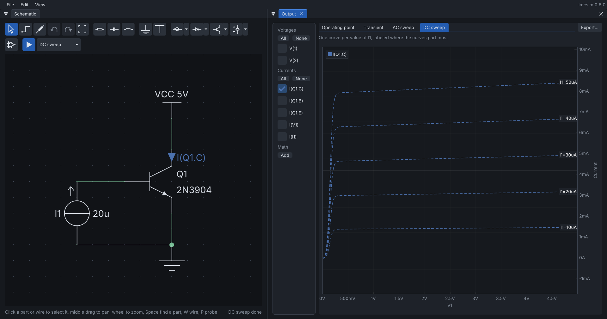

# imcsim

[](https://github.com/ronnymilleo/imcsim/actions/workflows/ci.yml)

Immediate Mode Circuit Simulator, built with Dear ImGui and SDL3. Circuits are simulated with
[ngspice](https://ngspice.sourceforge.io/).


New to imcsim? The [tutorial](docs/tutorial.md) builds, simulates and exports a first circuit in about ten minutes.

## Features

- Resistors, capacitors, inductors, ground, a VCC rail, and voltage and current sources (DC, sine or pulse)
- Diodes, Zener diodes, LEDs, NPN and PNP bipolar transistors, and N- and P-channel MOSFETs, each with ready models
  or custom SPICE parameters
- Controlled sources (VCVS, VCCS, CCCS, CCVS), and op-amps: ideal with a gain-bandwidth product and an output
  limited by its supply pins, or a uA741 or custom part built as a Boyle macromodel from datasheet values (slew rate,
  bias current, output swing, current limit)
- Warnings when a diode goes into reverse breakdown or a transistor exceeds its voltage, current or power ratings
- Operating point, transient, AC sweep and DC sweep analyses, with node voltages and component currents
- Plots of transients, Bode diagrams and DC sweeps (including curve families, such as transistor characteristics):
  pick what to measure with the Probe tool, read every trace under the cursor, currents dashed apart from voltages;
  measured voltages and currents are marked on the schematic in the colors of their traces, currents with an arrow
  in the direction they flow when positive
- Oscilloscope-style measurements beside the transient and Bode plots: two draggable cursors, peak-to-peak, mean,
  RMS and frequency of every trace, and peak, -3 dB band, unity gain frequency and phase margin of a response
- Math channels on transient and DC sweep plots, as on an oscilloscope: an operation between two traces picked
  with buttons, or a typed expression such as `V(1,2)`, `V(3)*I(R1)` or `ddt(V(2))`, with units followed (W, Ohm,
  V/s) and a third axis for any unit other than volts and amperes
- Operating point results on the schematic: values on hover, and wires colored by node, by voltage or by a current
  heat map that shows the path of the current
- Exports for reports: plots as SVG images (light for print or dark, at any size) or CSV tables, and the schematic
  as an SVG image with its probes, so the two figures can be shown side by side
- Nine color themes, seven dark and two light, switched from the View menu (see [Themes](docs/themes.md))
- IEC or ANSI symbols, optional terminal numbers, parts rotated (R) and mirrored left to right (M) or top to bottom
  (Shift+M), undo and redo, and schematics saved as JSON together with the settings of every analysis and the
  measured traces
- Dockable windows: the schematic, plots, properties, analysis settings and netlist float or dock beside, above,
  below or as tabs of each other, and the layout is kept between sessions
- A toolbar of part icons drawn from the symbols themselves, a part search (Space), menus with shortcuts, a status
  bar with the keys of the current mode, and the Output window opening on each new result
- Part properties in a popover beside the part (double click or Enter), values typed straight onto a selected
  part (`4k7`), a right-click menu, and Fit (Home)
- Run (F5) from the toolbar, with the analysis and its settings beside it, settings suggested from the sources and
  parts, and the result of the last run in the status bar
- Example circuits, each with its analyses and measurements set up: an RC low-pass filter, a full-bridge rectifier,
  an LED driver, an op-amp inverting amplifier, an ideal transformer made of controlled sources, the output
  characteristics of a BJT and its small-signal model

## Screenshots

Bode plot of a common-emitter stage next to its hybrid-pi model, with the -3 dB band and the peak of each response:


Output characteristics of a 2N3904 from a stepped DC sweep, one curve per base current:



## Documentation

The [tutorial](docs/tutorial.md) walks through a first circuit step by step. The [user guide](docs/user_guide.md)
explains the editor, terminal numbers, current signs, probes, plots and exports, and
[Simulation models](docs/models.md) describes the model behind every part and what it leaves out. [Themes](docs/themes.md)
shows the same circuit and its plots in each color theme.

## Install

- **Windows 10 or newer** (x64): download `imcsim-<version>-windows-x64.zip` from the
  [releases](https://github.com/ronnymilleo/imcsim/releases), extract it anywhere and run `imcsim.exe`. It carries
  ngspice; it needs nothing else installed.
- **Any Linux distribution** with glibc 2.39 or newer (Ubuntu 24.04, Debian 13, Fedora 40 and later): download the
  AppImage from the [releases](https://github.com/ronnymilleo/imcsim/releases), make it executable and run it:

  ```
  chmod +x imcsim-*-x86_64.AppImage
  ./imcsim-*-x86_64.AppImage
  ```

  It carries ngspice and SDL3; only a Vulkan driver for your GPU is needed.
- **Arch Linux**: the package is not on the AUR yet, since AUR registrations are paused for now. Until it is, build
  it from the PKGBUILD in this repository, which builds the release it names:

  ```
  cd packaging/aur
  makepkg -si
  ```

The layout, theme and view preferences are kept in `imgui.ini`, in `~/.local/share/imcsim` on Linux and
`%APPDATA%\imcsim` on Windows.

To build from source instead, read on.

## Requirements

- A GPU and driver that support Vulkan on Linux, or Direct3D 12 on Windows (see [below](#windows))
- CMake 4.3 or newer
- A C++23 compiler (tested with GCC 16)
- Ninja (or another CMake generator)
- The build dependencies of SDL3 (X11, Wayland, libxkbcommon): SDL itself is a submodule in `vendor/`,
  compiled and linked statically with the project, so every platform carries the same version
- On Linux, the Vulkan loader at run time (`vulkan-icd-loader` on Arch, `libvulkan1` on Ubuntu), which SDL
  opens when the program starts
- ngspice built as a shared library (`libngspice` and its `sharedspice.h` header; tested with ngspice 47)
- pkg-config, which CMake uses to find ngspice
- Git, for the submodules in `vendor/`: SDL3, Dear ImGui (`docking` branch), ImPlot,
  nlohmann/json and Catch2

On Arch Linux:

```
sudo pacman -S cmake ninja gcc pkgconf vulkan-icd-loader ngspice \
    libxcursor libxi libxfixes libxinerama libxrandr libxss libxtst libxkbcommon wayland wayland-protocols libdecor mesa
```

The Arch `ngspice` package already includes the shared library. Also install the Vulkan driver for your GPU
(for example `vulkan-radeon`).

On Ubuntu 25.04 or newer:

```
sudo apt install ninja-build g++ pkgconf libvulkan1 mesa-vulkan-drivers libngspice0-dev \
    libx11-dev libxext-dev libxrandr-dev libxcursor-dev libxi-dev libxss-dev libxfixes-dev libxtst-dev \
    libxkbcommon-dev libwayland-dev wayland-protocols libdecor-0-dev libegl-dev
sudo snap install cmake --classic
```

Ubuntu's own `cmake` package is older than 4.3, hence the snap. The default `g++` must support C++23; if the build
fails on missing standard library features, install a newer one (for example `g++-15`) and configure with
`-DCMAKE_CXX_COMPILER=g++-15`. These Ubuntu instructions are not tested regularly; please report what differs.

Other distributions usually split ngspice into a development package, such as `libngspice-devel` on Fedora.
If CMake reports `No package 'ngspice' found`, the shared library or its `ngspice.pc` file is missing.

## Build and run

```
git clone --recurse-submodules <repository-url>
cd imcsim
cmake -S . -B build -G Ninja -DCMAKE_BUILD_TYPE=Debug
cmake --build build
./out/debug/bin/imcsim
```

If you already cloned without submodules, run `git submodule update --init`.

The binary is written to `out/<build-type>/bin/`.

### Windows

Build with Visual Studio 2026 (the "Desktop development with C++" workload, which brings CMake and Ninja), from a
Developer PowerShell. The program renders with Direct3D 12, part of Windows, and the repository carries the
Windows build of ngspice in `vendor/ngspice-windows`, so nothing else is needed:

```
cmake -S . -B build -G Ninja -DCMAKE_BUILD_TYPE=Debug
cmake --build build
out\debug\bin\imcsim.exe
```

The build copies `ngspice.dll` next to the executable. `cmake --install build --prefix <folder>` lays out the
folder of the release zip.

## Tests

The tests use Catch2 and run some circuits through ngspice, so they need the same libraries as the application:

```
cmake -S . -B build -G Ninja -DCMAKE_BUILD_TYPE=Debug -DBUILD_TESTS=ON
cmake --build build
ctest --test-dir build --output-on-failure
```

## Optional

- `clang-format`: if installed, the build formats the sources automatically.
- `vulkan-validation-layers` (Linux): Debug builds use them when they are installed; on Windows the Direct3D 12
  debug layer comes with the system.

## License

imcsim is free software: you can redistribute it and/or modify it under the terms of the GNU General Public License
as published by the Free Software Foundation, either version 3 of the License, or (at your option) any later version
(`GPL-3.0-or-later`). See [LICENSE](LICENSE) for the full text.

The libraries in `vendor/` and ngspice keep their own licenses.
