# imcsim tutorial

This tutorial builds an RC low-pass filter from an empty schematic, simulates it, reads the results and exports
them. It takes about ten minutes and touches every part of the application. The [user guide](user_guide.md) is the
reference for what each control does, and [Simulation models](models.md) describes the model behind every part.

The circuit is a 1 kΩ resistor in series with a 100 nF capacitor, driven by a 1 V, 1 kHz sine. Its corner
frequency is 1 / (2π × 1 kΩ × 100 nF) ≈ 1.6 kHz, so a 1 kHz signal comes out of the capacitor slightly smaller and
delayed. The same circuit ships as File > Examples > RC low-pass filter, in case you want to compare.

## 1. Place the parts

Start with File > New (Ctrl+N). The window is the schematic editor: a toolbar on top, the grid in the middle and a
status bar at the bottom that always lists the keys of what you are doing.

The toolbar groups its buttons:

- Select, Wire and Probe, then Undo, Redo and Fit;
- resistor, capacitor and inductor;
- ground and VCC;
- sources, diodes, transistors and controlled sources, each a button with a dropdown arrow beside it;
- the op-amp;
- Run, with the analysis it runs.

Hover any button for its name and shortcut.

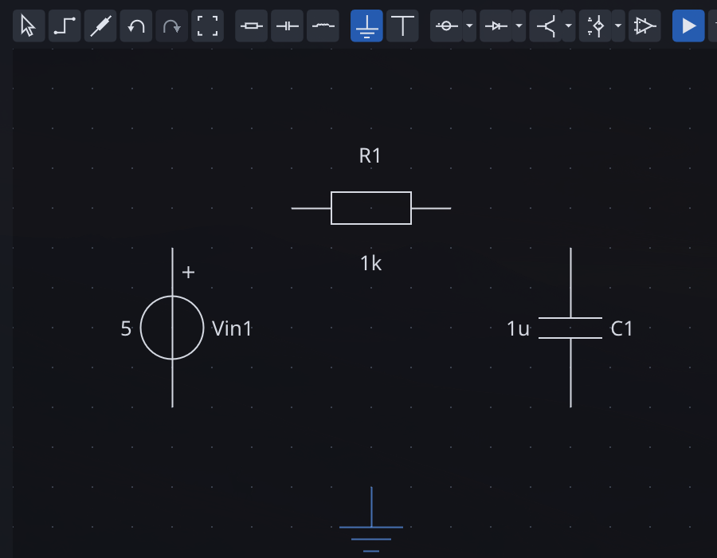

1. Click the first button of the sources group, the voltage source. It follows the cursor; press R to rotate it
   upright and click to place it. Placing stays active, so you can drop several parts in a row; press Esc or right
   click to stop.
2. Click the resistor button and place it to the right of the source, a little higher.
3. Click the capacitor button, press R to stand it upright, and place it to the right of the resistor.
4. Click the ground button and place it below, between the source and the capacitor.

Parts are named in SPICE order as you place them: Vin1, R1, C1. Instead of the toolbar, you can press Space over
the editor and type part of a name, such as `cap` or `mos`, then Enter.

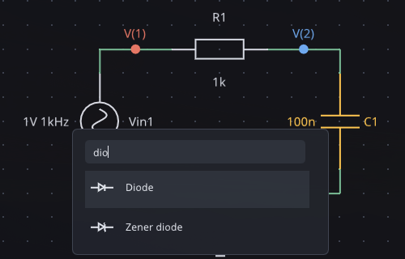

## 2. Wire them

Press W, or click the Wire button. Click a terminal to start a wire, click on the grid to add a bend, and click
another terminal to end it. Wires run in straight segments; F flips the bend from horizontal-first to
vertical-first.

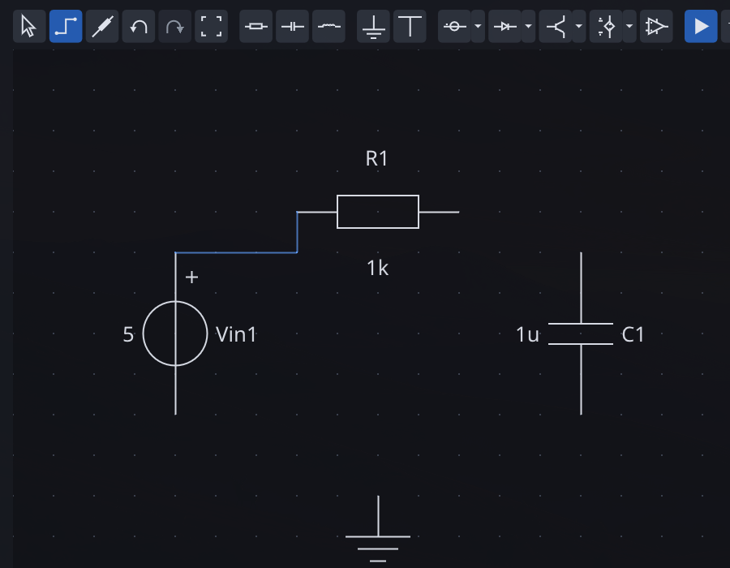

Connect:

- the top of the source to the left end of the resistor;
- the right end of the resistor to the top of the capacitor;
- the bottom of the source to the bottom of the capacitor;
- the ground to that bottom wire.

A dot marks every junction where three or more wires meet. Press Esc to leave wire mode. If something went wrong,
Ctrl+Z undoes it.

## 3. Set the values

Every part opens its properties when you double-click it, or select it and press Enter. Double-click the source and
switch it from DC to AC. The defaults are what this tutorial needs: 1 V amplitude, 1 kHz, no offset and an AC
magnitude of 1.

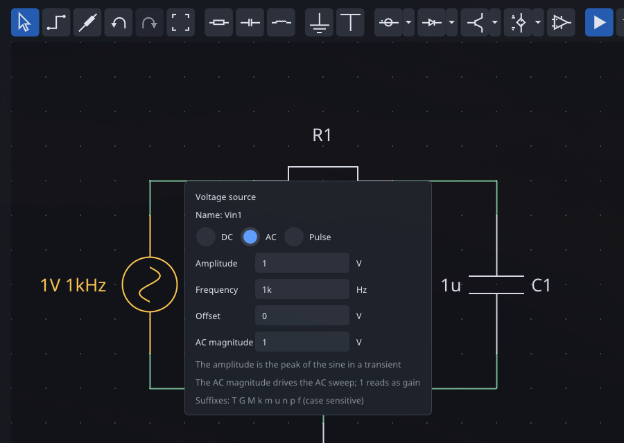

Edits apply as you type; Enter, Esc or a click outside closes the popover. The AC magnitude is what an AC sweep
uses; the amplitude is the peak of the sine in a transient. Both are explained in the user guide.

For parts with a single value there is a shorter way: select the part and just start typing. Select C1 and type
`100n`, then Enter.

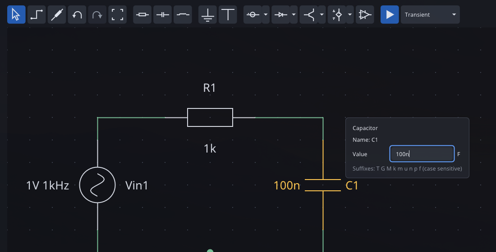

Values take SPICE suffixes, case sensitive: T, G, M (mega), k, m (milli), u, n, p and f. A whole number may put its
decimals after the suffix, as resistor codes do: `4k7` is 4.7 kΩ. R1 already has the 1k it needs.

A right click on a part opens everything else it can do: rotate, mirror, flip, measure its current and delete.

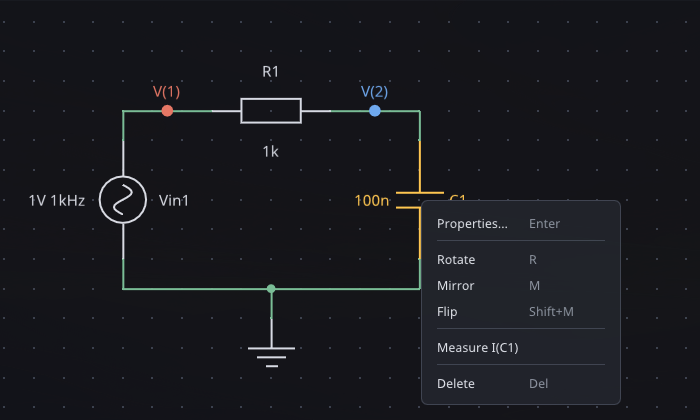

## 4. Choose what to measure

Plots start empty, so first pick what to measure. Press P, or click the Probe button, and click the wire between
the source and the resistor, then the wire between the resistor and the capacitor. They become V(1) and V(2),
marked with a colored dot in the colors their traces will have. Hovering a wire in probe mode shows what a click
would measure.

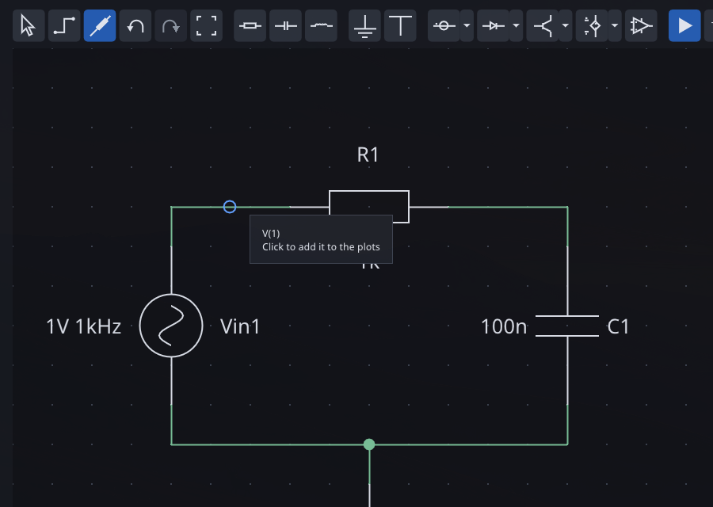

Clicking a part instead measures its current, and clicking a measured item again stops measuring it. Press Esc to
leave probe mode. You can also pick traces later in the Output window.

## 5. Run a transient

The button beside Run names the analysis it runs. Click it to open the analysis list and the settings of the
selected one. Pick Transient and click Suggest: it reads the 1 kHz sine and proposes five periods, 5 ms, with a step
of 5 µs.

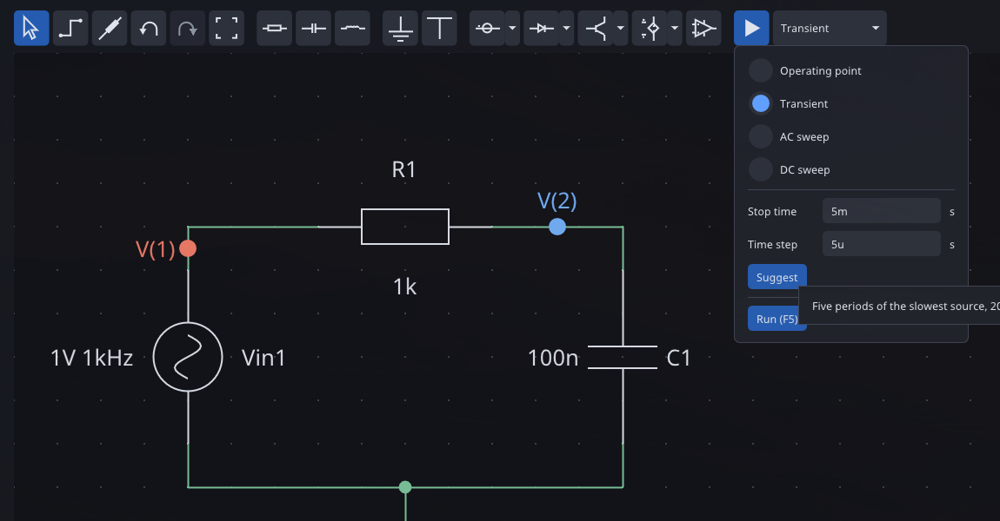

Click Run, or close the list and press F5. ngspice runs the circuit, the status bar reports "Transient done", and the
Output window opens on the Transient tab, as a tab beside the schematic. Every window can float or dock: drag it by its
title and drop it on one of the arrows that appear, to place it beside, above or below another window or as a tab
of it. The pictures here dock Output on the right of the schematic. The layout is kept for the next session, and
View > Reset Layout brings back the default one.

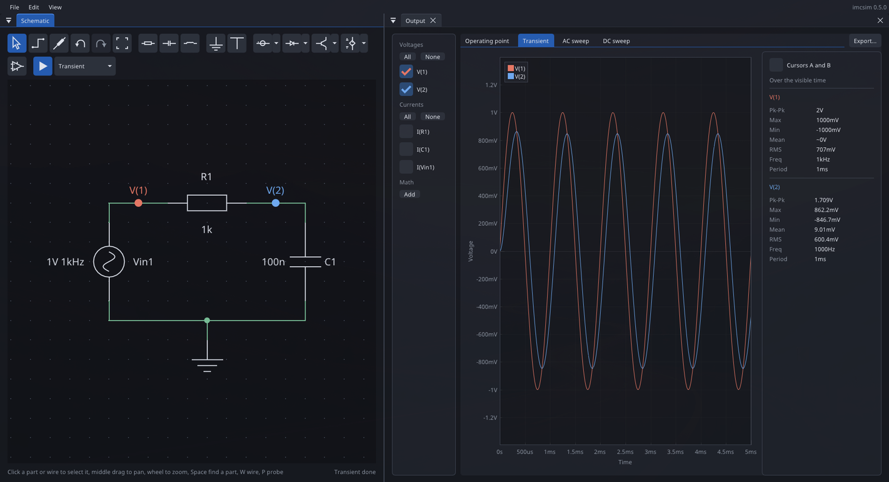

V(2), across the capacitor, is about 0.85 V peak and lags V(1), as the corner at 1.6 kHz predicts. The panel on the
right lists the peak-to-peak, mean, RMS and frequency of each trace. Nothing runs by itself: after any edit, run
again with F5.

If a run fails, the status bar says so in red; click it for the error and the ngspice output.

## 6. Read the plots

- **Zoom and pan**: drag a box or use the wheel on the plot; double-click fits it again.
- **Cursors**: check "Cursors A and B" and drag the two vertical lines. The panel shows the time between them and the
  statistics over that span only.
- **Trace list**: the column on the left turns traces on and off, voltages and currents apart.
- **Math channels**: click Add under Math and pick V(1) - V(2). The new trace, M1, is the voltage across the
  resistor. A channel can also be an expression such as `V(1)*I(R1)` or `ddt(V(2))`, with its unit worked out.

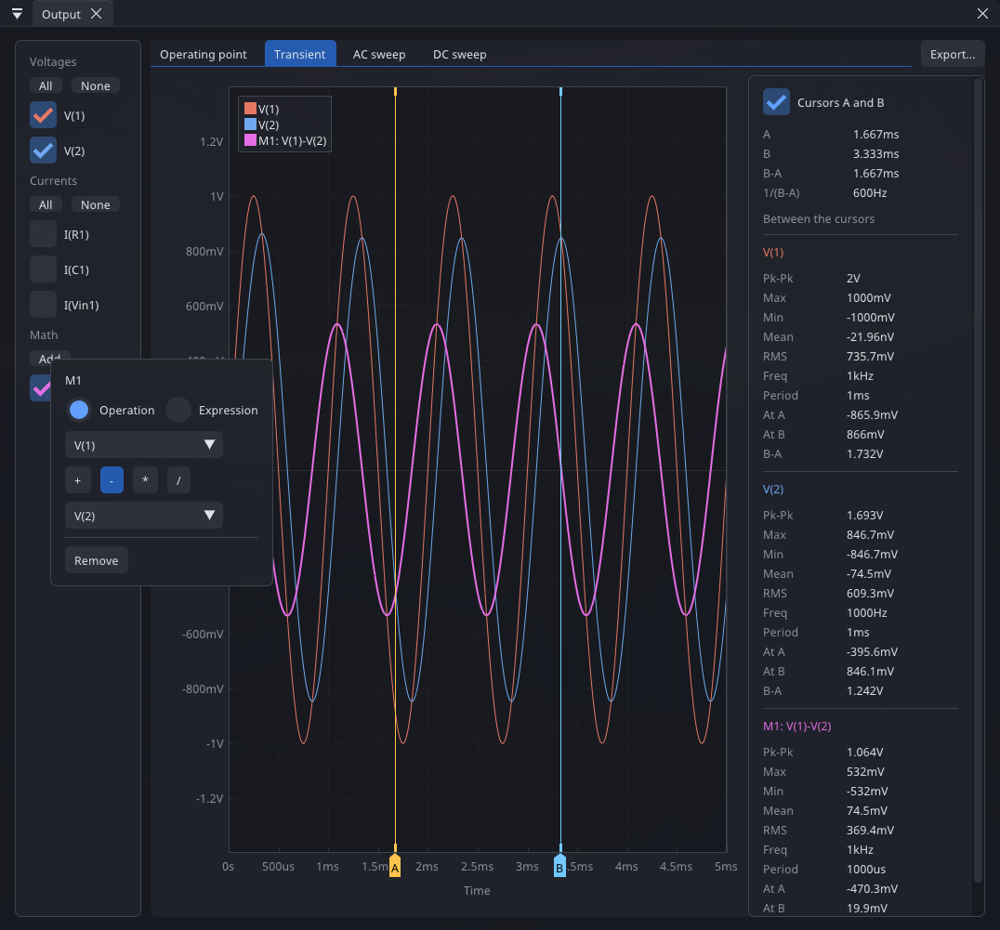

## 7. Sweep the frequency

Open the analysis list again, pick AC sweep and click Suggest: it proposes 10 Hz to 1 MHz, two decades on each side
of the corner. Run it. The AC sweep tab shows a Bode plot of magnitude and phase, and the panel finds the -3 dB
frequency of V(2) at about 1.59 kHz, the corner worked out at the start.

The same plot for a larger circuit, the Small-signal model of a BJT example, compares a transistor stage with its
hybrid-pi model:

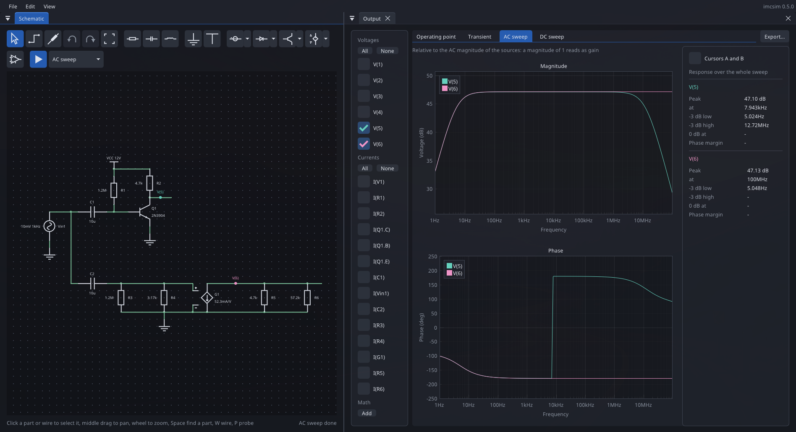

## 8. Other analyses

- **Operating point**: the DC voltages of every node, shown on the schematic and, with the currents, in the Output
  window. View > Wire Colors colors the wires by node, by voltage or by a current heat map that follows the path of
  the current. For this circuit, with a sine source and no offset, everything is 0 V.
- **DC sweep**: steps a source through a range and plots the results against it, optionally stepping a second source
  for a family of curves. The BJT output characteristics example sweeps the collector voltage for five base
  currents:

View > Analysis Settings keeps the settings of the selected analysis open in a window, if you prefer them in view.

## 9. Export and save

Export... at the right of the Output tabs saves the plot of the current tab:

- **SVG image**: redrawn from the data, so it stays sharp at any size; light for print, or dark.
- **CSV table**: every sample of every measured trace, math channels included.

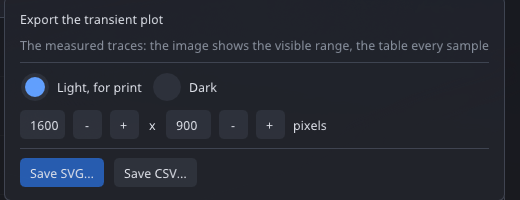

File > Export Schematic... saves the circuit as an SVG image with its probes in the colors of the traces, so the
schematic and the plots read as one figure.

Save the schematic with Ctrl+S. The file keeps the circuit, the selected analysis with the settings of every
analysis, and the measured nodes and currents, so reopening it is one F5 away from the same plots.

## Where to go next

- Open the other examples in File > Examples; each has its analyses and measurements set up.
- Try the transistors, diodes and op-amps: each takes a ready model or custom SPICE parameters in its properties.
- View > Theme switches between Graphite, Ember, Phosphor and the light Paper.
- Read the [user guide](user_guide.md) for terminal order, current signs and the details of each plot, and
  [Simulation models](models.md) for what each part leaves out.
