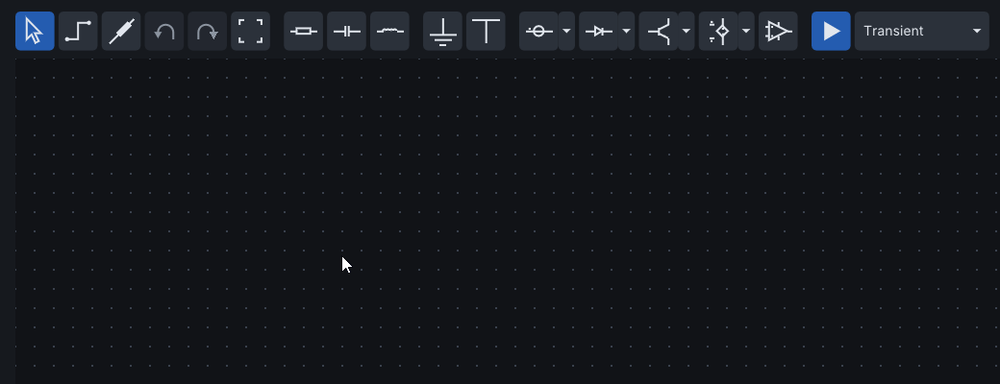
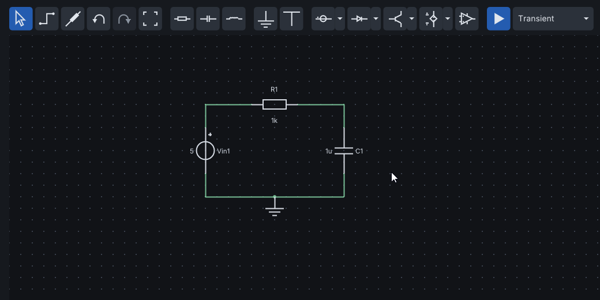
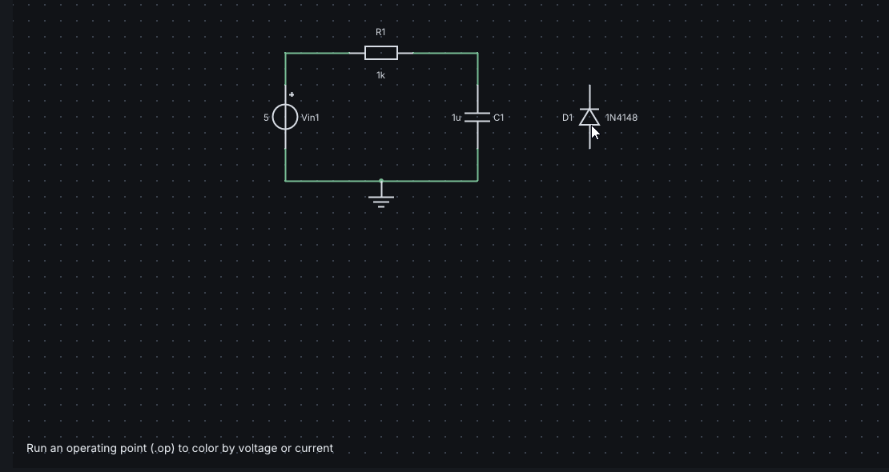
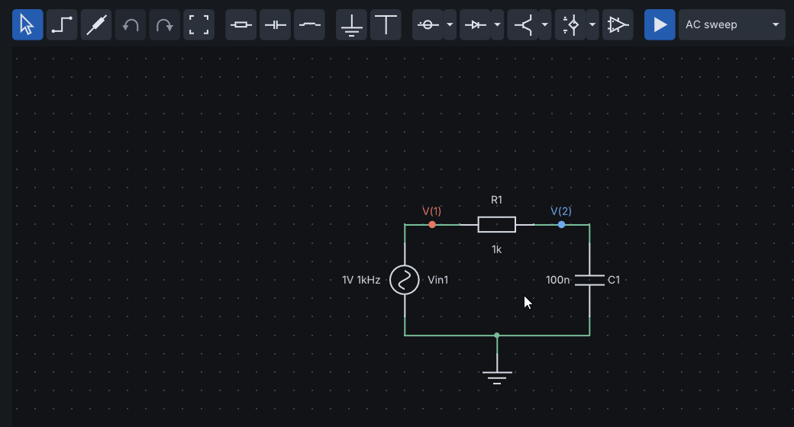
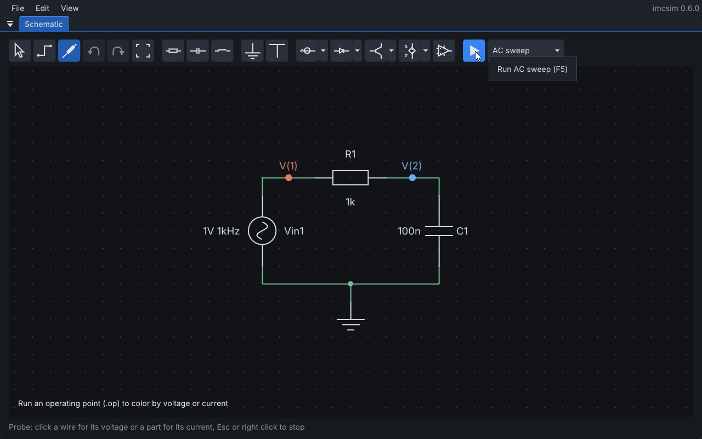
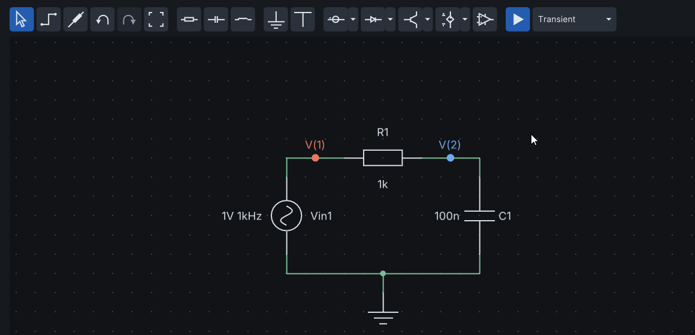
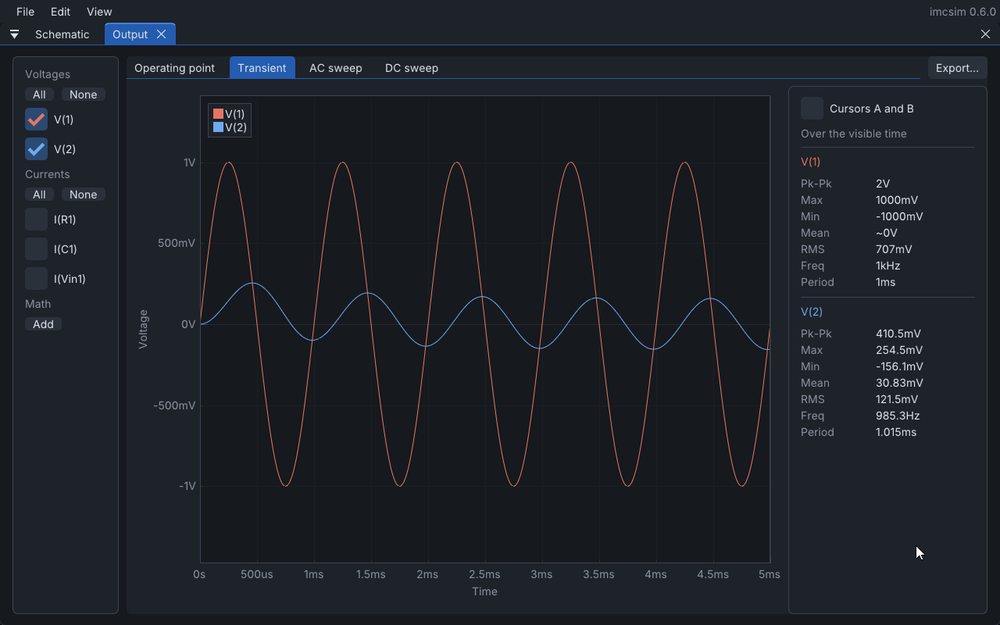
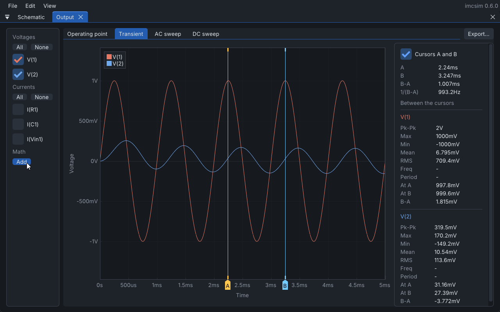
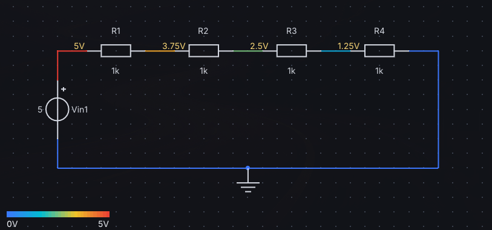

# imcsim tutorial

This tutorial draws a circuit from an empty schematic, then simulates an RC low-pass filter, reads the results and
exports them. It takes about ten minutes and touches every part of the application. The [user guide](user_guide.md)
is the reference for what each control does, and [Simulation models](models.md) describes the model behind every part.

The filter is a 1 kΩ resistor in series with a 100 nF capacitor, driven by a 1 V, 1 kHz sine. Its corner frequency is
1 / (2π × 1 kΩ × 100 nF) ≈ 1.6 kHz, so a 1 kHz signal comes out of the capacitor slightly smaller and delayed.

## 1. Draw a circuit

Start with File > New (Ctrl+N). The window is the schematic editor: a toolbar on top, the grid in the middle and a
status bar at the bottom that always lists the keys of what you are doing.

The toolbar groups its buttons:

- Select, Wire and Probe, then Undo, Redo and Fit;
- resistor, capacitor and inductor;
- ground and VCC;
- sources, diodes, transistors and controlled sources, each a button with a dropdown arrow beside it;
- the op-amp;
- Run, with the analysis it runs.

Hover any button for its name and shortcut.

1. Click the first button of the sources group, the voltage source. It follows the cursor; press R to rotate it
   upright and click to place it. Placing stays active, so you can drop several parts in a row; press Esc or right
   click to stop.
2. Place a resistor to the right of the source, a little higher, then a capacitor (R to stand it upright) to the
   right of the resistor, and a ground below them.
3. Press W, or click the Wire button. Click a terminal to start a wire, click on the grid to add a bend, and click
   another terminal to end it. Wires run in straight segments; F flips the bend from horizontal-first to
   vertical-first. Connect the four parts in a loop and the ground to the bottom wire.

Parts are named in SPICE order as you place them: Vin1, R1, C1. A dot marks every junction where three or more wires
meet. Press Esc to leave wire mode; Ctrl+Z undoes any step.

## 2. Find a part

Instead of the toolbar, press Space over the editor and type part of a name, such as `dio`, `cap` or `mos`. Up and
Down move through the list and Enter starts placing the part, which can be rotated with R before the click that
places it.

## 3. Edit a part

A right click on a part opens everything it can do: its properties, rotate, mirror, flip, measure its current and
delete. Properties... opens a popover beside the part, as does a double click, or Enter with the part selected.
Edits apply as you type; Enter, Esc or a click outside closes it.

Diodes, transistors and op-amps take a ready model, such as the 1N4148 diode, or Custom, which shows the SPICE
parameters of the model to edit one by one. Values take SPICE suffixes, case sensitive: T, G, M (mega), k,
m (milli), u, n, p and f.

## 4. Open the example

The rest of the tutorial uses File > Examples > RC low-pass filter, the filter described at the top: Vin1 is an AC
source of 1 V at 1 kHz, R1 is 1k and C1 is 100n. Since the schematic has unsaved changes, imcsim asks to discard
them first.

The source properties hold both of its AC values: the amplitude is the peak of the sine in a transient, and the AC
magnitude is what an AC sweep uses, where 1 reads as gain. Both are explained in the user guide.

## 5. Choose what to measure

Plots show only what is measured. The example already measures V(1) and V(2), marked on the schematic with a colored
dot in the colors their traces will have. Press P, or click the Probe button, and hover a wire: the tooltip says what
a click would measure. Clicking a wire measures the voltage of its node, clicking a part measures its current, and
clicking a measured item again stops measuring it.

Press Esc to leave probe mode. You can also pick traces later in the Output window.

## 6. Run

The button beside Run names the analysis it runs, AC sweep in this example. Click it to open the analysis list with
the settings of the selected one; Suggest proposes them from the sources and parts, such as five periods of the
slowest sine for a transient. The example comes with every analysis set.

Click Run, or press F5. ngspice runs the circuit, the status bar reports the result, and the Output window opens by
itself, as a tab beside the schematic, on the tab of the new analysis.

- **AC sweep**: a Bode plot of magnitude and phase from 10 Hz to 1 MHz. The panel on the right finds the -3 dB
  frequency of V(2) at about 1.59 kHz, the corner worked out at the start.
- **Transient**: pick Transient in the analysis list and run again. V(2), across the capacitor, is about 0.85 V peak
  and lags V(1), as the corner at 1.6 kHz predicts. The panel lists the peak-to-peak, mean, RMS and frequency of
  each trace.

Every window can float or dock: drag it by its title or tab and drop it on one of the arrows that appear, to place it
beside, above or below another window or as a tab of it. The layout is kept for the next session, and View > Reset
Layout brings back the default one.

If a run fails, the status bar says so in red; click it for the error and the ngspice output.

## 7. Change a value

Parts with a single value take it straight from the keyboard: select C1 and type `1u`, then Enter. A whole number may
put its decimals after the suffix, as resistor codes do: `4k7` is 4.7 kΩ.

Nothing runs by itself: after any edit, run again with F5. With 1 µF the corner drops to about 160 Hz, and the 1 kHz
sine comes out of the capacitor at about 0.16 V peak. The next plots use this transient.

## 8. Read the plots

- **Zoom and pan**: drag a box or use the wheel on the plot; double-click fits it again.
- **Trace list**: the column on the left turns traces on and off, voltages and currents apart.
- **Cursors**: check "Cursors A and B" and drag the two vertical lines. The panel shows the time between them and the
  statistics over that span only, with the value of each trace at each cursor.

- **Math channels**: click Add under Math. A new channel starts as an operation between two traces, here changed to
  V(1) × I(R1), the power the source delivers to the filter. Its unit is worked out as you edit it, V² for
  V(1) × V(2) and W once the second trace is a current, and the plot gives it an axis of its own. A channel can also
  be an expression such as `V(1)-V(2)` or `ddt(V(2))`.

## 9. Other analyses

- **Operating point**: the DC voltages of every node, shown on the schematic and, with the currents, in the Output
  window. View > Wire Colors colors the wires by node, by voltage or by a current heat map that follows the path of
  the current. For this circuit, with a sine source and no offset, everything is 0 V; a divider of four equal
  resistors shows the voltage colors better, from blue at ground to red at the source:

  

- **AC sweep of a larger circuit**: the Small-signal model of a BJT example compares a transistor stage with its
  hybrid-pi model:

  

- **DC sweep**: steps a source through a range and plots the results against it, optionally stepping a second source
  for a family of curves. The BJT output characteristics example sweeps the collector voltage for five base
  currents:

  

View > Analysis Settings keeps the settings of the selected analysis open in a window, if you prefer them in view.

## 10. Export and save

Export... at the right of the Output tabs saves the plot of the current tab:

- **SVG image**: redrawn from the data, so it stays sharp at any size; light for print, or dark.
- **CSV table**: every sample of every measured trace, math channels included.

File > Export Schematic... saves the circuit as an SVG image with its probes in the colors of the traces, so the
schematic and the plots read as one figure.

Save the schematic with Ctrl+S. The file keeps the circuit, the selected analysis with the settings of every
analysis, and the measured nodes and currents, so reopening it is one F5 away from the same plots.

## Where to go next

- Open the other examples in File > Examples; each has its analyses and measurements set up.
- Try the transistors, diodes and op-amps: each takes a ready model or custom SPICE parameters in its properties.
- View > Theme switches between nine color themes, shown side by side in [Themes](themes.md).
- Read the [user guide](user_guide.md) for terminal order, current signs and the details of each plot, and
  [Simulation models](models.md) for what each part leaves out.
